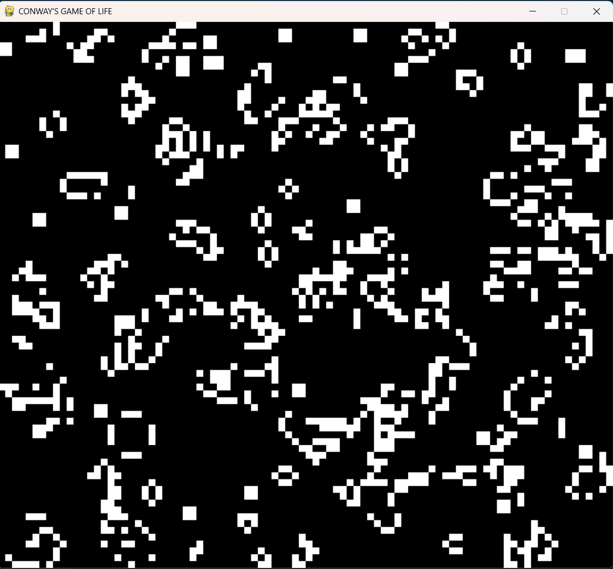

# Conway's Game of Life

An interactive Python implementation of John Conway's classic cellular automaton, built using Pygame. 



## Overview

This project is a simulation of the famous zero-player game devised by mathematician John Conway. The simulation evolves on a 2D grid based on initial configurations, following a specific set of rules that determine whether cells live, die, or multiply. It serves as an exploration of grid-based logic, state management, and real-time rendering in Python.

### The Rules
* **Underpopulation:** A live cell with fewer than 2 live neighbors dies.
* **Survival:** A live cell with 2 or 3 live neighbors lives on to the next generation.
* **Overpopulation:** A live cell with more than 3 live neighbors dies.
* **Reproduction:** A dead cell with exactly 3 live neighbors becomes a live cell.

---

## Getting Started

### Prerequisites
Make sure you have Python installed. You will also need the `pygame` library.

### Installation & Running

1. Install the required dependency:
```bash
   pip install pygame